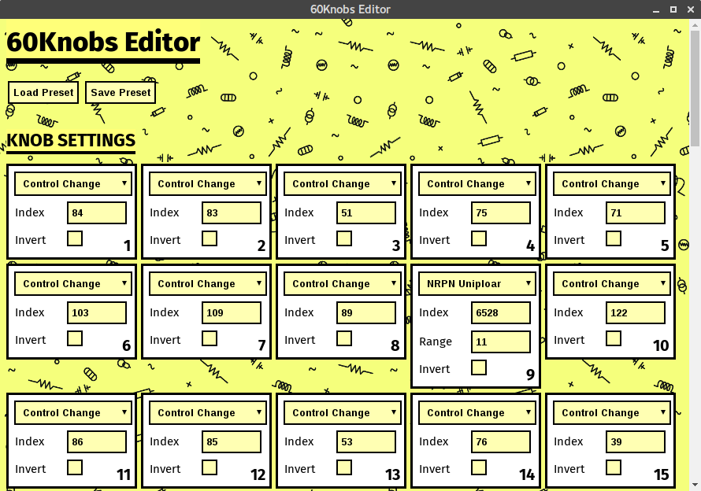

# 60Knobs Editor

Standalone program for Linux/MacOS/Windows to allow editing presets of [Bastl Instruments' 60Knobs](http://www.bastl-instruments.com/instruments/sixtyknobs/) via MIDI SysEx messages.

Currently those builds are available

| Operating System | Details |
| ----| --------|
| Linux | AppImage compiled on Debian Stretch amd64 |
| MacOS | DMG compiled on High Sierra 10.13.1 |
| Windows | Portable and Installer compiled on Windows 7 32bit |
